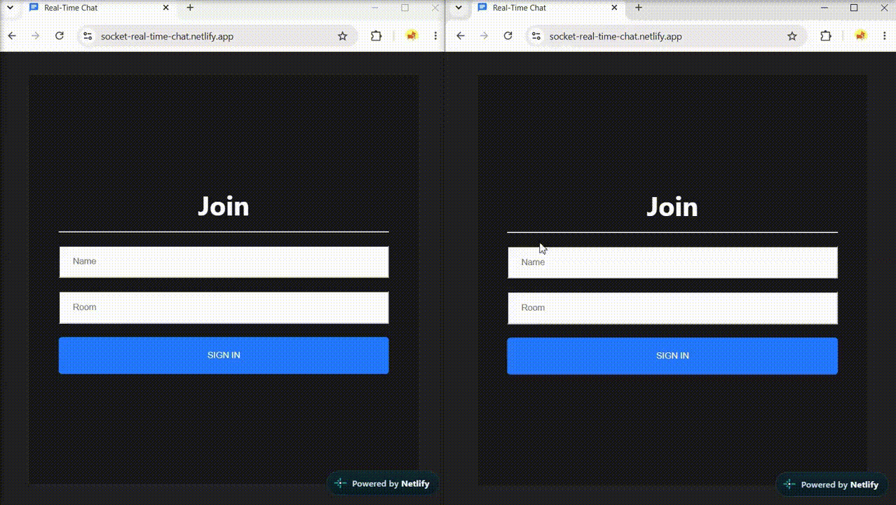

# 💬 Real-Time Chat

Веб-приложение для обмена сообщениями в реальном времени. Проект построен с использованием **WebSocket-соединения через Socket.io**, благодаря чему сообщения и изменения списка пользователей мгновенно отображаются у всех участников чата без необходимости обновления страницы.

Пользователь может присоединиться к чату, после чего получает приветственное сообщение от администратора. При выходе пользователя из чата остальные участники получают системное сообщение о том, что пользователь покинул чат. Также в приложении отображается список пользователей, которые находятся в чате в данный момент.

❗️❗️ Некоторый функционал приложения может быть недоступен в России.

🌐 [Демо проекта](https://socket-real-time-chat.netlify.app/)

## 📸 Превью

<div>
    
</div>

## 🛠️ Стек

### Frontend

* React
* TypeScript
* Socket.io Client
* CSS
* Vite

### Backend

* Node.js
* Express
* Socket.io

### Common

* Commitlint
* Husky
* lint-staged

## 🎯 Функционал

* Подключение пользователей к чату в реальном времени
* Обмен сообщениями между участниками без перезагрузки страницы
* Автоматическое приветственное сообщение при подключении нового пользователя
* Уведомление участников чата при выходе пользователя
* Отображение списка пользователей, находящихся в чате
* Синхронизация сообщений между всеми подключёнными пользователями
* Проверка уникальности имени пользователя перед подключением к чату
* Поддержка нескольких одновременных подключений

## 🔌 Как работает приложение

Взаимодействие между клиентом и сервером реализовано с помощью **Socket.io**.

1. Пользователь подключается к серверу и присоединяется к чату.
2. Сервер отправляет приветственное сообщение от администратора.
3. Сервер добавляет пользователя в список активных участников.
4. Все подключённые пользователи получают актуальный список участников.
5. Сообщения пользователя передаются на сервер.
6. Сервер отправляет сообщение всем участникам чата в реальном времени.
7. При отключении пользователя сервер отправляет системное сообщение о его выходе и обновляет список активных участников.

## 🚀 Установка и запуск

1. Клонируйте репозиторий
```
git clone https://github.com/bemfes/real-time-chat.git
```

2. Установите зависимости
```
npm install
```

3. Создайте env файл в папке client с переменной VITE_SERVER_URL
```
VITE_SERVER_URL=http://localhost:5000
```

4. Создайте env файл в папке server с переменными PORT и CLIENT_URL
```
CLIENT_URL=http://localhost:5173

PORT=5000
```

5. Запустите проект (сразу server и client) в корневой директории
```
npm run start
```

## 📬 Контакты

Анастасия Устин

* Telegram: @annastin28
* Email: anastasiia_ustin@mail.ru
